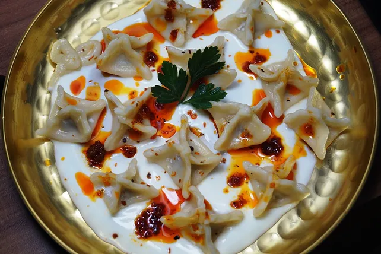

Hallo, ich bin Dursel.
---
Manti (Gefüllte Teigtaschen)

Für den Teig:
500 g	Mehl
1	Ei(er)
1 TL	Salz
Mehl für das Tablett

Für die Füllung:
250 g	Rinderhackfleisch und Lammhackfleisch, gemischtes
1	Zwiebel(n)
2 EL	Petersilie, gehackte
Salz und Pfeffer
Paprikapulver

Für die Sauce:
750 g	Joghurt
3	Knoblauchzehe(n)
3 EL	Butter
2 EL	Paprikamark, scharfes
1 EL	Minze, getrocknete