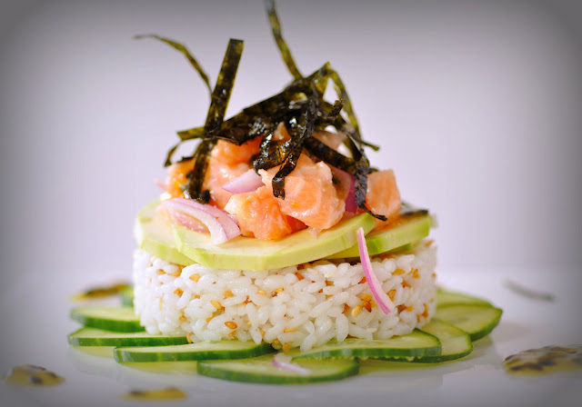

# SUSHI / CEVICHE: A JAPANESE / PERUVIAN FUSION

Dreaming about vacations by the sea? Late summer nights sharing dinner with friends? Well, this is THE thing for you....Why? Because you'll have very fresh fish available (this is mandatory for any dish with raw fish!), because it's easy and fast and healthy (low in fat, high in proteins)...and because you'll be able to "lecture" about the differences between sushi and ceviche...and you'll impress all your friends !!! (LOL) Please, don't forget to say that your personal guru Cristina told you all this... ;D  
Seriously speaking, what is called New Peruvian Cuisine has jumped to international recognition and admiration thanks to the job of young Peruvian chefs like Gaston Acurio.

## To make this sushi / ceviche, you will need:

- very fresh salmon, 400gr
- passionfruit, 2
- honey, 2 tablespoons
- chili pepper, 1
- nori seaweed sheet, 1
- avocado, 2
- cucumber, 1
- red onion, 1/2
- lime juice, 1
- olive oil, 1 teaspoon

  
