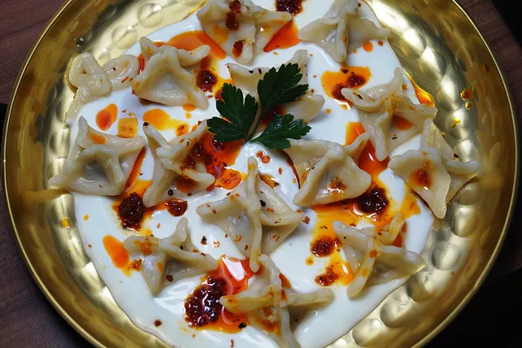

# Drink: Pisco Sour (serves 4 people)

## Ingredients:

- 4 measures of pure Peruvian Pisco (Acholado)

- 1 measure of gum syrup

- 1 measure of key lime juice

- 1/8 of a measure of an egg white

- 4 ice cubes

- 3 drops of Angostura Bitters (Chuncho)

## Preparation:

Place all the ingredients, except for the Angostura Bitters, in the order listed above in a cocktail shaker. Shake for 15 seconds. Strain and serve in a chilled, 8 oz. cocktail glass. Decorate the top with 3 drops of Angostura Bitters.

